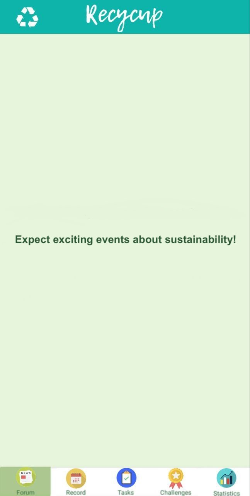
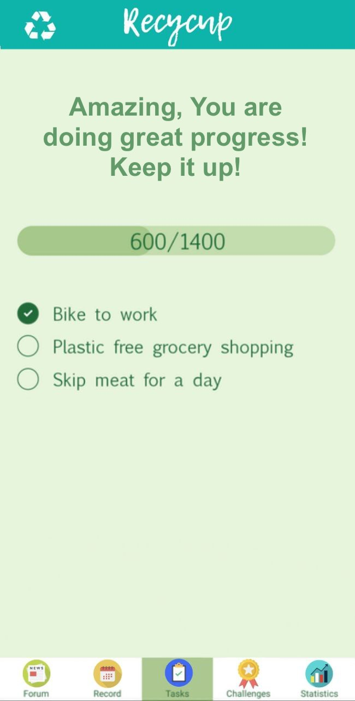
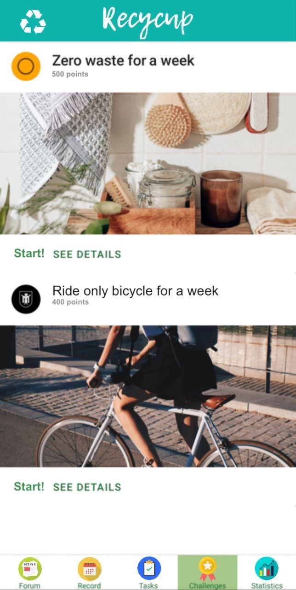
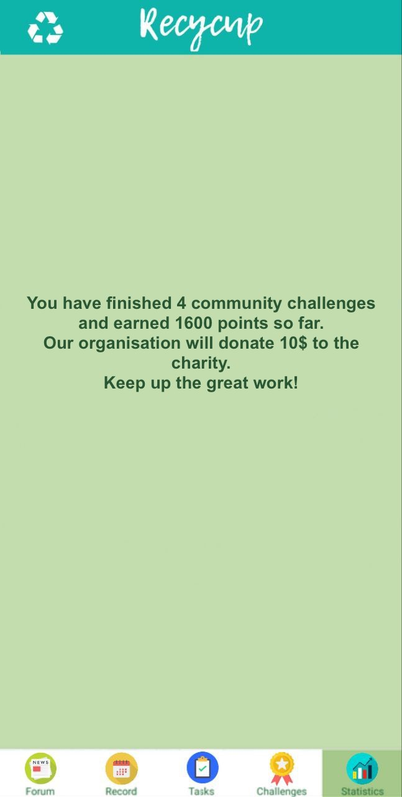

# Recycup
We as individuals care deeply about the future of our planet. But as much as we hope to contribute to a sustainable world, there's only so much  that we can do:

**Each year, a handful of corporations contribute to a large percentage of CO2 emissions [1](https://www.statista.com/chart/19594/20-firms-produced-a-third-of-global-emissions/), toxic waste release [2](https://www.statista.com/statistics/799176/largest-corporate-water-polluters-in-the-us/), and single use plastic production (from non-recycled material) [3](https://www.npr.org/2021/05/18/997937090/half-of-the-worlds-single-use-plastic-waste-is-from-just-20-companies-says-a-stu).**

While we initially wanted to create a habit tracker for sustainable living (that gamifies simple tasks such as biking to work), we felt it was not enough. Then we came up with an idea that might bring out the synergy of individuals' effort towards sustainability---recycup.

## About recycup

**recycup** provides a platform for individuals to contribute to a common goal---sustainable living. 

For individual users, it is first of all a habit tracker that keeps track of your daily effort to live more sustainably, whether you are already an experienced zero-waste guru or want to embark on a sustainable journey today. 
- For each completed daily task ("quest"), users receive a fixed sum of plantey points. 
- plantey points can be spent on a sustainability initiative---sponsored by our business partners---to show care and support for the cause. 
- We (will) provide comprehensive statistics and record on habit building, task completion, challenge participation, and most importantly the "rewards" earned by every user, providing a sense of accomplishment that is directly linked to real-world impact. 

An example: an individual user finishes the "Zero waste for a week" challenge by completing subtasks daily. They earned 1000 points for the challenge and 500 points for the daily tasks. In return, the challenge sponsor helps donate x 100$ to a local charity of users choice. 

## What's next for recycup

An important step is to find business partners that like the idea.

We still need to integrate the frontend with the backend. And then hopefully publishing the app on Google Play Store and then on Apple App Store. 

