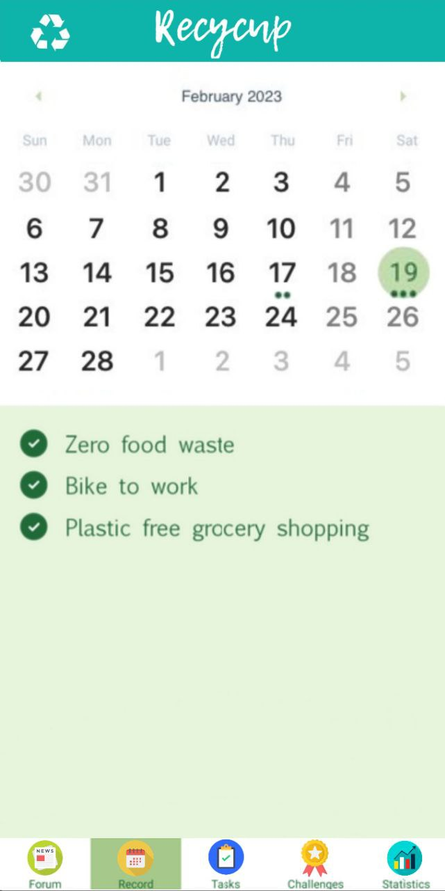

# Recycup
Individually, we are deeply concerned about the future of our planet. But, no matter how much we hope to contribute to a more sustainable world, there is only so much we can do:

Every year, a modest number of corporations contribute a significant portion of CO2 emissions, toxic waste release, and single-use plastic production (from non-recycled materials).

While we initially intended to develop a habit tracker for sustainable living (that gamifies simple tasks like biking to work), we felt this was insufficient. Then we came up with an idea that might bring out the synergy of individuals' effort towards sustainability---recycup.

## About recycup

**recycup** provides a platform for individuals to contribute to a common goal---sustainable living. 
For individual users, it is first and foremost a habit tracker that keeps track of your daily efforts to live more sustainably, whether you are a seasoned zero-waste guru or just starting out on your sustainable journey.
- For each completed daily task ("quest"), users receive a fixed sum of plantey points. 
- plantey points can be spent on a sustainability initiative---sponsored by our business partners---to show care and support for the cause. 
- We (will) provide comprehensive statistics and record on habit building, task completion, challenge participation, and most importantly the "rewards" earned by every user, providing a sense of accomplishment that is directly linked to real-world impact. 

An example: an individual user finishes the "Zero waste for a week" challenge by completing subtasks daily. They earned 1000 points for the challenge and 500 points for the daily tasks. In return, the challenge sponsor helps donate x 100$ to a local charity of users choice. 

## What's next for recycup

Finding business partners who support the concept is an important first step.

We still need to connect the frontend and backend. The app will then hopefully be released on Google Play and then on Apple App Store.

